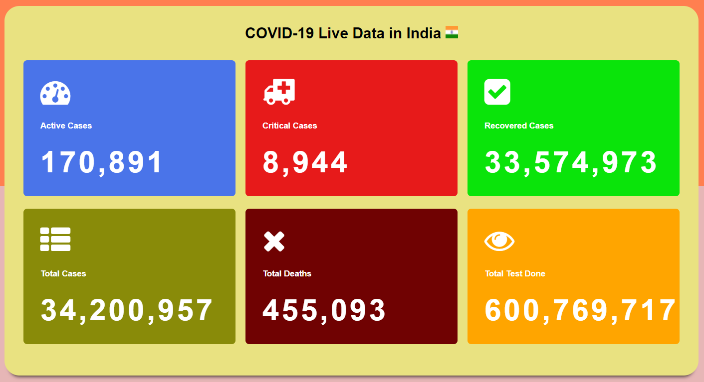

# Covid-19 using API

In this project I will be showing live data of corona counts of active cases, critical cases, recovered cases, total cases, total deaths and total test done in countries by using api. The problem Covid -19 solves it will help people to find the immediate count status of the ongoing pandemic to which ever country they want to travel. Travel cannot be avoided completely, but people will be able to make sound decisions when it comes to travelling in this pandemic.
 
 
 

